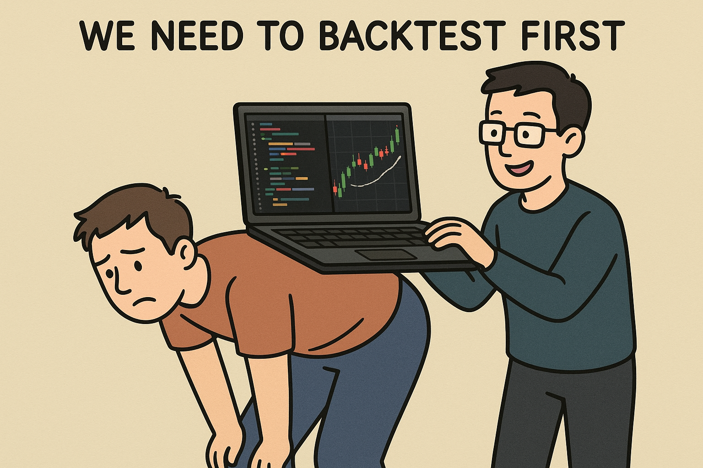

# Low/High Reversal Strategy Backtester

A comprehensive backtesting system for cryptocurrency trading that implements a low/high reversal strategy using real market data from Binance.



## 🎯 Strategy Overview

This backtester implements a **Low/High Reversal Strategy** that:

### Long Positions (Buy Low)
- Identifies significant price lows using technical analysis
- Enters long positions by buying **0.15% above** significant lows
- Targets price reversals after major drops

### Short Positions (Sell High)
- Identifies daily high points in price action
- Enters short positions by selling **0.15% below** daily highs
- Profits from price corrections after peaks

### Risk Management
- **Stop Loss**: Configurable percentage-based stop losses (3-8%)
- **Trailing Stops**: Dynamic profit protection (1-4%)
- **Position Sizing**: Fixed capital allocation per trade

## 🔍 What the Backtester Does

### 1. Data Collection
- Fetches top cryptocurrencies by market cap from CoinGecko
- Downloads historical price data from Binance API
- Uses hourly candlestick data for accurate backtesting
- Implements intelligent caching to reduce API calls

### 2. Opportunity Detection

#### Significant Lows Algorithm
- Analyzes 40+ data points around each potential low
- Requires minimum 1% drop before the low
- Requires minimum 1% recovery after the low
- Calculates significance scores based on drop magnitude and recovery

#### Daily Highs Algorithm
- Groups data by trading days
- Identifies the highest price point of each day
- Filters for days with meaningful price ranges (>1%)
- Ranks opportunities by daily volatility

### 3. Parameter Optimization
Tests multiple parameter combinations:
- **Long Offset**: 0.05% to 0.30% (entry above lows)
- **Short Offset**: 0.05% to 0.30% (entry below highs)
- **Stop Loss**: 3% to 8% (maximum loss per trade)
- **Trailing Stop**: 1% to 4% (profit protection)

### 4. Strategy Simulation
- Simulates real trading conditions
- Tracks capital allocation and position management
- Implements realistic entry/exit mechanics
- Calculates comprehensive performance metrics

### 5. Performance Analysis
Generates detailed metrics including:
- **Total Return**: Overall profit/loss percentage
- **Win Rate**: Percentage of profitable trades
- **Profit Factor**: Ratio of gross profits to gross losses
- **Maximum Drawdown**: Largest peak-to-trough decline
- **Trade Statistics**: Number of trades, average wins/losses

## 📊 Output Results

The backtester produces:

### 1. Console Output
Real-time progress updates and final rankings of top-performing cryptocurrencies

### 2. JSON Results File (`results.json`)
```json
{
  "backtest_info": {
    "strategy": "Low/High Reversal",
    "backtest_period_days": 7,
    "total_coins_tested": 30,
    "successful_backtests": 19,
    "timestamp": "2025-08-26T18:56:24"
  },
  "top_10_results": [
    {
      "symbol": "BTC",
      "name": "Bitcoin",
      "total_return_pct": 5.23,
      "win_rate": 75.0,
      "total_trades": 8,
      "profit_factor": 2.1,
      "max_drawdown": 3.2,
      "best_params": {
        "long_offset_percent": 0.15,
        "short_offset_percent": 0.15,
        "stop_loss_percent": 5.0,
        "trailing_stop_percent": 2.0
      }
    }
  ]
}
```

### 3. Log Files
Detailed execution logs stored in `logs/low_high_reversal_backtester.log`

## 🚀 Getting Started

### Prerequisites
```bash
# Install required dependencies
pip install -r requirements.txt
```

### Running the Backtester
```bash
# Run with default settings (top 30 coins, 7 days)
python3 backtest/multi_token_backtester_low_high_reversal.py
```

### Configuration Options
Edit the configuration variables in the script:

```python
BACKTEST_DAYS = 7                    # Number of days to backtest
INITIAL_CAPITAL = 100.0              # Starting capital for simulation
MAX_CONCURRENT_BACKTESTS = 5         # Parallel processing limit

# Parameter optimization ranges
LONG_OFFSET_RANGE = (0.05, 0.30, 0.05)   # Min, Max, Step
SHORT_OFFSET_RANGE = (0.05, 0.30, 0.05)
STOP_LOSS_RANGE = (3.0, 8.0, 1.0)
TRAILING_STOP_RANGE = (1.0, 4.0, 0.5)
```

## 📁 File Structure

```
├── backtest/
│   ├── multi_token_backtester_low_high_reversal.py  # Main backtester
│   ├── logs/                                        # Log files (auto-created)
│   └── data_cache/                                  # Cached price data (auto-created)
├── requirements.txt                                 # Python dependencies
├── README.md                                        # This file
└── results.json                                     # Backtest results (generated)
```

## 🔧 Technical Features

### Multi-Threading
- Concurrent backtesting of multiple cryptocurrencies
- Configurable thread pool size for optimal performance
- Thread-safe logging and data handling

### Data Caching
- Intelligent caching system reduces API calls
- 1-hour cache expiration for fresh data
- Automatic cache directory creation

### Error Handling
- Robust error handling for network issues
- Graceful degradation when data is unavailable
- Comprehensive logging for debugging

### Performance Optimization
- Vectorized calculations using NumPy and Pandas
- Efficient data structures for large datasets
- Memory-conscious processing for extended backtests

## 📈 Interpreting Results

### Key Metrics Explained

- **Total Return %**: Overall profit/loss from the strategy
- **Win Rate %**: Percentage of trades that were profitable
- **Profit Factor**: Gross profits ÷ Gross losses (>1.0 is profitable)
- **Max Drawdown %**: Largest decline from peak equity
- **Total Trades**: Number of completed trades during the period

### Best Practices

1. **Focus on Win Rate**: Higher win rates indicate more consistent performance
2. **Consider Drawdown**: Lower maximum drawdown means less risk
3. **Analyze Trade Count**: More trades provide better statistical significance
4. **Review Parameters**: Optimal parameters vary by market conditions

## ⚠️ Important Notes

### Limitations
- **Historical Performance**: Past results don't guarantee future performance
- **Market Conditions**: Strategy performance varies with market volatility
- **Execution Assumptions**: Assumes perfect order execution at target prices
- **Transaction Costs**: Does not include trading fees or slippage

### Risk Disclaimer
This backtester is for educational and research purposes only. Cryptocurrency trading involves substantial risk of loss. Always conduct thorough testing and risk assessment before implementing any trading strategy with real capital.

## 🛠️ Customization

### Adding New Strategies
The backtester framework can be extended to test other strategies by modifying:
- Opportunity detection algorithms
- Entry/exit logic
- Risk management rules
- Performance scoring methods

### Extending Analysis
Additional analysis can be added:
- Sharpe ratio calculations
- Correlation analysis
- Market condition filtering
- Advanced statistical metrics

## 📞 Support

For questions, issues, or contributions, please refer to the project documentation or create an issue in the repository.

---

**Happy Backtesting! 📊🚀**
